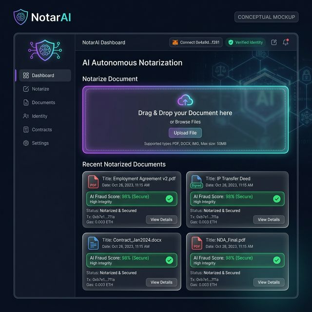
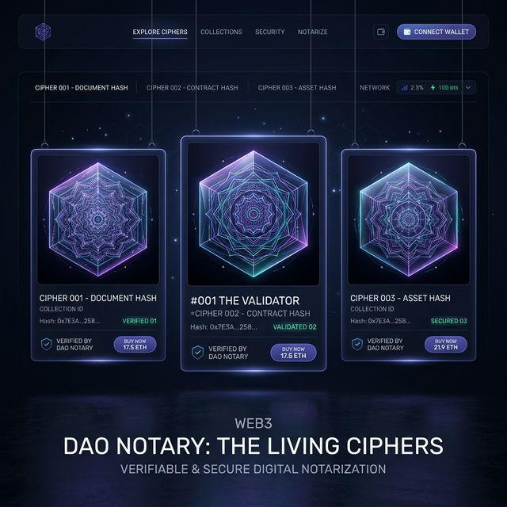

# AI Autonomous Notary — Customer End-User Frontend Blueprint

## Vision

The end-user application is the **face of the platform** — a web3-native, mobile-responsive portal where individuals, businesses, notaries, and investors can notarize documents, issue NFT seals, manage fractional ownership, and participate in the Document Securities Market without needing to understand blockchain internals.

> **Design philosophy**: Web2-simple UX, Web3-powered backend. Users should never need to understand gas or contract addresses.

---

## Application Architecture

> **Conceptual Mockup**: The image below is a high-fidelity rendering demonstrating the intended dark-mode glassmorphism aesthetic and core layout. It is a visual concept, not a final implemented design.




```
┌────────────────────────────────────────────────────────────────┐
│  Frontend Application (Next.js 14 App Router)                   │
│                                                                  │
│  ┌──────────────┐  ┌──────────────┐  ┌──────────────────────┐  │
│  │  Public Site │  │  User Portal │  │  Notary Professional │  │
│  │  (landing,   │  │  (docs, NFTs,│  │  Dashboard (mint,    │  │
│  │   pricing)   │  │   portfolio) │  │  verify, manage)     │  │
│  └──────────────┘  └──────────────┘  └──────────────────────┘  │
│                                                                  │
│  Shared Services: Wallet connection, IPFS, Oracle data feeds     │
└────────────────────────────────────────────────────────────────┘
           │                    │                    │
    Smart Contracts       IPFS/Filecoin         AI Oracle API
   (Phase 1 ✅)         (document storage)    (validation backend)
```

---

## Technology Stack

| Layer | Technology | Rationale |
|---|---|---|
| **Framework** | Next.js 14 (App Router) | SSR for SEO, RSC for performance |
| **Styling** | Tailwind CSS + shadcn/ui | Rapid, consistent, accessible UI |
| **Web3** | wagmi v2 + viem | Modern React hooks for contracts |
| **Wallet** | RainbowKit | Multi-wallet support out of the box |
| **Storage** | IPFS via Pinata SDK | Decentralized document storage |
| **State** | Zustand + TanStack Query | Global state + server cache |
| **Auth** | SIWE (Sign In With Ethereum) | Walletless-friendly, no passwords |
| **Animations** | Framer Motion | Premium feel, document transitions |
| **Charts** | Recharts | Portfolio value, token price history |

### The "Living Cipher" NFT Concept
To make the notarization NFTs highly desirable and instantly recognizable, we will move beyond standard QR codes. Instead, the AI generates a **Cryptographic Mandala** (or "Living Cipher").

**How it works (Steganography):**
The NFT artwork is a stunning, high-end geometric pattern (glowing cybernetic lines, sacred geometry). However, the specific thickness, colors, intersection angles, and wave frequencies are mathematically derived directly from the document's SHA-256 hash and the AI fraud score. While a human sees a beautiful abstract piece of digital art, our platform scanner can "read" the geometry to instantly verify the document, acting as an unforgeable, machine-readable visual signature.

**Conceptual Mockup:**


| **PDF** | pdf-lib + react-pdf | Document preview and generation |
| **Notifications** | React Hot Toast | Transaction status feedback |

---

## User Segments & Portal Flows

### 1. 📄 Document Owner (Primary User)
*Individual or business that wants to notarize a document*

**Onboarding flow:**
```
Land on homepage → See "Notarize a Document" CTA
  → Connect wallet (MetaMask/Coinbase/WalletConnect)
  → Sign in with SIWE (single message, free)
  → Upload document (PDF/image)
  → AI preliminary scan (fraud score preview, 10s)
  → Select notarization tier (Standard/Premium/Institutional)
  → Pay fee (ETH or NOTARY token, 20% discount)
  → Document registered on-chain + IPFS
  → NFT seal minted to wallet
  → Email/notification: "Your document is notarized. View certificate."
```

**Key pages:**
- `/upload` — drag-and-drop document upload with live AI score preview
- `/documents` — list of all owned/notarized documents with status
- `/documents/[tokenId]` — single document certificate page (shareable)
- `/documents/[tokenId]/verify` — public verification page (no wallet needed)

---

### 2. 🏛️ Notary Professional
*Licensed notary who performs multi-party signings and earns fees*

**Onboarding flow:**
```
Apply for notary status → Submit W3C VC (license credential)
  → DID verification flow
  → Admin approval (Phase 1: manual; Phase 2: on-chain credential)
  → NOTARY_ROLE granted
  → Access professional dashboard
```

**Key pages:**
- `/notary/dashboard` — pending notarizations queue, earnings, reputation score
- `/notary/sessions/[id]` — real-time multi-party signing session (EIP-712)
- `/notary/clients` — client management and document history
- `/notary/earnings` — fee breakdown, royalty income from secondary sales
- `/notary/credentials` — manage professional DID and VCs

---

### 3. 💰 Fractional Investor
*User who wants to invest in document-backed assets*

**Onboarding flow:**
```
Browse Marketplace → See live document assets (real estate deeds, IP, etc.)
  → View document details (AI score, valuation, yield history)
  → Complete KYC flow (accredited investor verification)
  → Buy fractional shares (from FractionalizationVault ERC-20)
  → Portfolio dashboard shows holdings + live yield accrual
```

**Key pages:**
- `/marketplace` — browse all live fractionalized document assets
- `/marketplace/[vaultAddress]` — single asset page with price chart, revenue history, buy UI
- `/portfolio` — wallet holdings, unrealized gains, claimable yield
- `/portfolio/yield` — claim accumulated revenue distributions
- `/portfolio/buyout` — participate in or initiate vault buyout

---

### 4. 🔍 Verifier (Third Party)
*Bank, employer, court, or anyone who needs to verify a document*

**Flow (no wallet required):**
```
Receive verification link or QR code
  → land on /verify/[tokenId]
  → See document hash, notary address, timestamp, AI score
  → Download verification certificate (PDF)
  → Optional: API integration for bulk verification
```

**Key page:**
- `/verify/[tokenId]` — fully public, no wallet, SEO-optimized certificate page

---

## Core UI Components

### Document Upload Component
```typescript
// components/DocumentUpload/index.tsx
// Features:
// - Drag and drop (react-dropzone)
// - File hash computed client-side (SHA-256 via SubtleCrypto API)
//   → document never sent to our servers in plaintext
// - Live AI pre-scan: POST /api/ai/prescan with document metadata
// - Progress indicator: Upload → Hash → Register → Mint
// - File size limit: 50MB (IPFS chunked upload)
// - Supported: PDF, DOCX, JPG, PNG, TIFF
```

### NFT Seal Certificate Component
```typescript
// components/NFTSealCertificate/index.tsx
// Display:
// - Full-bleed document preview (PDF.js renderer)
// - Official AI Notary seal overlay (SVG, animated)
// - On-chain metadata: token ID, notary address, timestamp, AI score
// - QR code linking to /verify/[tokenId]
// - Download as PDF button (generates branded certificate)
// - Share button (Twitter/LinkedIn with NFT preview image)
```

### Fractional Share Purchase Widget
```typescript
// components/FractionPurchase/index.tsx
// Features:
// - Document backing details (underlying NFT preview)
// - Current share price from AMM (Phase 2) or floor price
// - Slippage tolerance selector
// - "Buy" → wagmi writeContract → FractionalizationVault/AMM
// - Real-time yield APR estimate based on document revenue history
// - Compliance check: verifies accredited investor status before UI shows
```

### Multi-Party Signing Session
```typescript
// components/SigningSession/index.tsx
// Features:
// - Real-time presence (WebSocket via Pusher/Ably)
// - Each party sees document + their signing position
// - EIP-712 typed data signature collection
// - Progress tracking: "2 of 3 parties signed"
// - Notary can finalize once all parties sign
// - Confirmation: all signatures aggregated on-chain
```

---

## Page Layouts & Design System

### Design Tokens
```css
/* Core palette — premium dark-mode first */
--color-primary: hsl(252, 100%, 70%);    /* Electric violet */
--color-accent:  hsl(172, 100%, 50%);    /* Cyber teal */
--color-bg:      hsl(224, 25%, 6%);      /* Deep navy */
--color-surface: hsl(224, 20%, 10%);     /* Card surface */
--color-border:  hsl(224, 15%, 16%);     /* Subtle border */

/* Typography */
--font-sans: 'Inter', system-ui;
--font-mono: 'Fira Code', monospace;     /* wallet addresses, hashes */

/* Effects */
--glow-primary: 0 0 40px hsl(252 100% 70% / 0.15);
--blur-glass:   backdrop-filter: blur(12px);
```

### Key Design Patterns
1. **Glassmorphism cards** — document cards with frosted glass effect, glowing border on hover
2. **Progress timelines** — notarization steps shown as animated vertical timeline
3. **Live data** — real-time price tickers, AI validation progress bars
4. **Trust indicators** — green checkmark animations when AI score > 90%, red flags for fraud
5. **Empty states** — illustrated empty states for new users ("Notarize your first document")
6. **Skeleton loading** — bone-style loading states for all contract data

---

## API Routes (Next.js)

```
/api/documents/upload          → Pinata IPFS upload, return CID
/api/documents/[id]/certificate → Generate PDF certificate
/api/ai/prescan                → AI fraud pre-scan (metadata only)
/api/verify/[tokenId]          → Public verification endpoint (no auth)
/api/oracle/price/[feedId]     → OracleManager price feed proxy
/api/kyc/status                → Accredited investor check (Persona/Jumio)
/api/webhooks/blockchain       → Listen for on-chain events (Alchemy notify)
/api/notifications/email       → Transactional emails (Resend)
```

---

## Wallet & Transaction UX

### Transaction Flow Pattern
Every contract interaction follows this UX pattern:
1. **Preview modal** — "You are about to: Notarize document XYZ. Gas estimate: ~$3.20"
2. **Wallet prompt** — RainbowKit modal opens for user to sign
3. **Pending state** — inline spinner + "Transaction submitted. Waiting for confirmation..."
4. **Success state** — confetti animation + "Your NFT seal is minted! View it →"
5. **Error handling** — human-readable error messages (not raw revert strings)

### Gasless Options (Phase 2)
- EIP-2771 meta-transactions for new user onboarding (sponsor first notarization)
- Coinbase Smart Wallet integration for seamless web2-like experience

---

## Mobile Responsiveness

All pages must work on mobile (primary use case: field notarization):

| Feature | Mobile Behavior |
|---|---|
| Document upload | Camera access for scanning physical docs |
| Signing sessions | Touch-optimized signature flow |
| Portfolio | Simplified card view, swipe to reveal yield |
| Verification | QR code scanner (ZXing.js) |
| Wallet | Deep link to MetaMask/Coinbase mobile |

---

## Performance & SEO

| Goal | Implementation |
|---|---|
| Core Web Vitals: LCP < 2.5s | Next.js Image + static landing |
| SEO for `/verify/[tokenId]` | Full SSR, OpenGraph metadata |
| Contract data caching | TanStack Query with 30s stale time |
| IPFS content | CDN-proxied via Pinata gateway |
| Bundle size | Dynamic imports for heavy components (PDF.js, QR) |

---

## Phase-Based Development Plan

### Phase 1 Frontend (Parallel to Smart Contract Phase 2 — 3 months)

| Sprint | Deliverable |
|---|---|
| 1 | Project scaffold (Next.js), design system, wallet connection |
| 2 | Document upload flow + IPFS integration |
| 3 | Notarize flow + on-chain registration UI |
| 4 | NFT seal certificate page + public verify page |
| 5 | Notary professional dashboard |
| 6 | AI score visualization + fraud alerts |
| 7 | Responsive polish + beta launch |

### Phase 2 Frontend (Parallel to Smart Contract Phase 3 — 3 months)

| Sprint | Deliverable |
|---|---|
| 1 | Marketplace browse + asset detail pages |
| 2 | Fractional share purchase widget |
| 3 | Portfolio dashboard + yield claim |
| 4 | AMM price charts + liquidity management |
| 5 | Lending/collateral UI |
| 6 | Governance voting interface |
| 7 | Mobile app (React Native + Expo) |

---

## KYC/Compliance Integration

The frontend enforces the same compliance rules as the smart contracts:

1. **Identity verification**: Persona.com SDK integration for KYC flow
2. **Accredited investor check**: Parallel.markets integration
3. **Geofencing**: IP-based jurisdiction detection, hard-blocks for restricted regions
4. **AML screening**: Chainalysis API for wallet address screening on large transactions
5. **Cookie/consent**: GDPR-compliant consent banner (no tracking without consent)

---

## Repository Structure

```
apps/
  web/                          ← Next.js 14 frontend
    app/
      (public)/                 ← Landing, pricing, about (no auth)
        page.tsx                ← Homepage
        verify/[tokenId]/       ← Public verification
      (portal)/                 ← Authenticated user area
        documents/              ← Document list + detail
        upload/                 ← Upload & notarize flow
        portfolio/              ← Holdings + yield
        marketplace/            ← Browse + buy fractionals
      (notary)/                 ← Notary professional area
        dashboard/
        sessions/[id]/
        credentials/
    components/                 ← Shared UI components
    hooks/                      ← wagmi contract hooks
    lib/                        ← IPFS, oracle, utils
    contracts/                  ← ABI + contract addresses per network

packages/
  contracts/                    ← Shared ABI exports (from Phase 1)
  ui/                           ← Design system + shadcn components

contracts/                      ← Solidity (existing Phase 1)
docs/                           ← Documentation
```

---

## Integration with Phase 1 Contracts

The frontend connects directly to deployed Phase 1 contracts via `wagmi` hooks:

```typescript
// hooks/useNotarize.ts
import { useWriteContract } from 'wagmi';
import { DocumentRegistryABI } from '@/contracts/abis';

export function useNotarize() {
  const { writeContract, isPending, isSuccess } = useWriteContract();
  
  const notarize = (documentHash: `0x${string}`, metadataHash: `0x${string}`, ipfsCID: string) => {
    writeContract({
      address: DOCUMENT_REGISTRY_ADDRESS,
      abi: DocumentRegistryABI,
      functionName: 'registerDocument',
      args: [documentHash, metadataHash, ipfsCID, 0, 'US', BigInt(Date.now() / 1000 + 365 * 86400)],
    });
  };
  
  return { notarize, isPending, isSuccess };
}
```

---

## Recommended Next Steps

1. **Start the frontend repo** — `npx create-next-app@latest apps/web --typescript --tailwind --app`
2. **Deploy contracts to Sepolia** — get real contract addresses for the dev environment
3. **Design mockups** — create Figma designs for the 5 core flows before writing code
4. **User research** — 5 interviews with target users (notaries, real estate agents, legal firms)
5. **Domain + branding** — register `ainotary.io` or similar and finalize the brand identity

> **Key insight**: The frontend is where **Phase 1 becomes investor-demoable**. A polished UI showing the document → NFT → fractional share flow, even running against a Sepolia testnet, will be infinitely more compelling to investors than showing them Hardhat test output.
